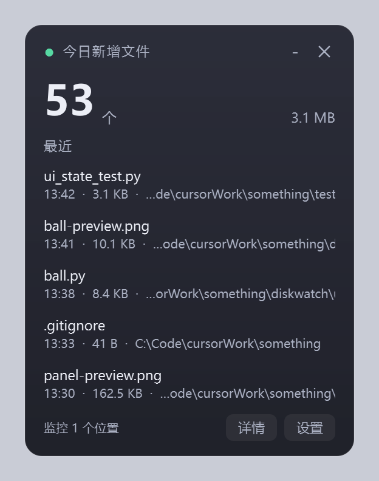
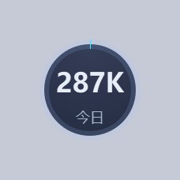
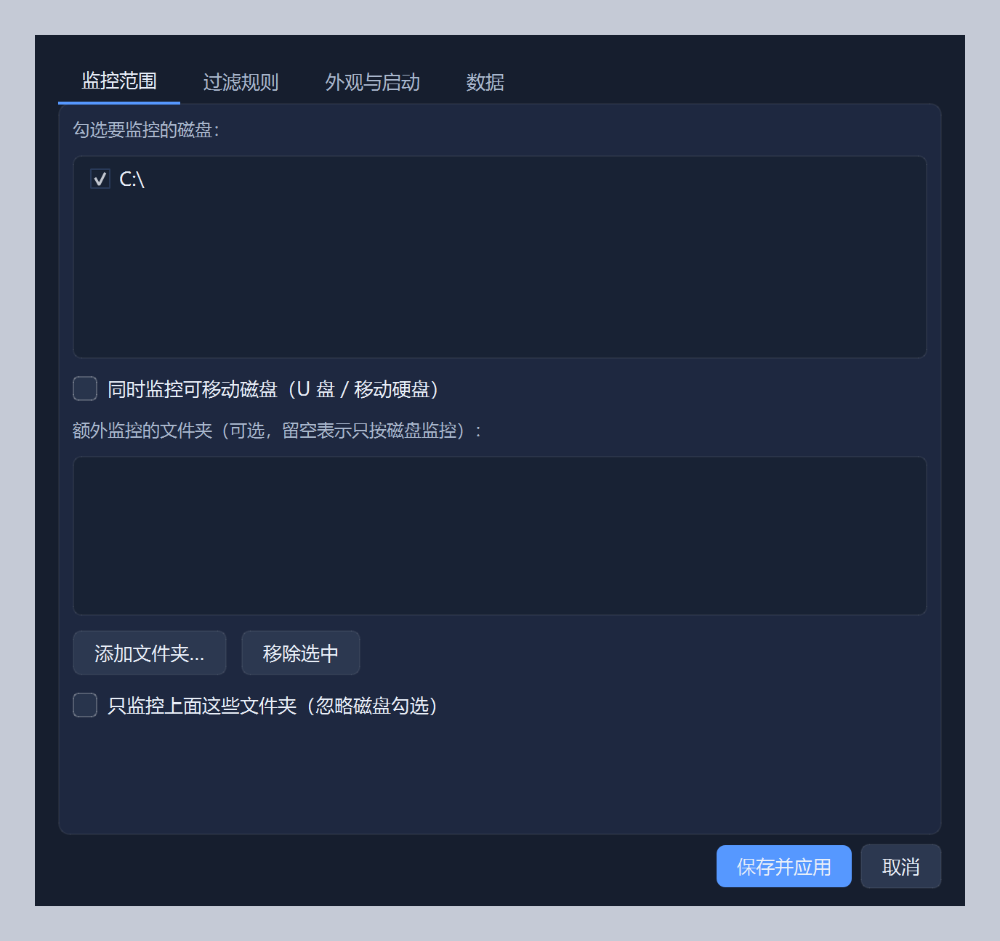
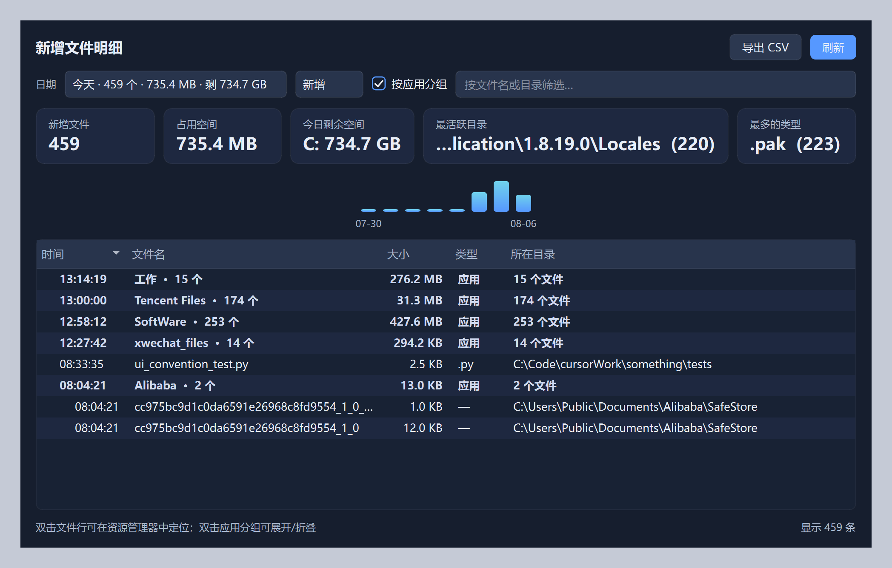

# DiskWatch

<p align="center">
  <strong>See what landed on your disk today.</strong><br/>
  <sub>Windows desktop widget · real-time new-file tracker · local only</sub>
</p>

<p align="center">
  今天硬盘上<strong>新长了哪些文件、一共多大</strong>？<br/>
  一张悬浮卡片 / 一颗迷你球，实时告诉你——数据只存在本机，不联网。
</p>

<p align="center">
  <a href="https://github.com/niujiaxu/DiskWatch/releases/latest"></a>
  <a href="https://github.com/niujiaxu/DiskWatch/stargazers"></a>
  <a href="LICENSE"></a>
  
  
</p>

<p align="center">
  <a href="https://github.com/niujiaxu/DiskWatch/releases/download/v1.1.1/DiskWatch-1.1.1-win64-portable.zip"><strong>⬇ Portable .exe (Windows x64)</strong></a>
  ·
  <a href="https://github.com/niujiaxu/DiskWatch/releases/download/v1.1.1/DiskWatch-1.1.1-src.zip">Source zip</a>
  ·
  <a href="https://github.com/niujiaxu/DiskWatch/releases/tag/v1.1.1">Release notes</a>
</p>

<p align="center">
  
  &nbsp;&nbsp;
  
</p>

---

## Why DiskWatch?

Installers, zip extracts, downloads, AI coding agents… your disk creates **thousands of files** you never consciously look at.

Most tools either dump a raw change list (noisy) or auto-sort your folders (invasive).  
DiskWatch does one job well:

> **Track “what was created today”, show it on the desktop, keep the noise out.**

| | FolderChangesView-style lists | Auto-organizers | **DiskWatch** |
|--|--|--|--|
| Real-time create events | ✅ | ✅ | ✅ |
| Day summary (count + size) | ❌ | ❌ | ✅ |
| Floating card / mini ball | ❌ | ❌ | ✅ |
| Smart filters (AppData / caches / PF) | weak | N/A | ✅ |
| Local SQLite history + CSV export | ❌ | ❌ | ✅ |
| Moves your files around | ❌ | ✅ | ❌ never |

中文一句话：**不是装完软件的流水账，也不是桌面整理器——是「今日新增文件」的桌面看板。**

---

## Features · 功能

- **Real-time** — Windows directory notifications via `watchdog` (no full-disk scan)
- **Floating card** — frameless, translucent, draggable, always-on-top
- **Mini ball** — 66px orb showing **today’s total size** + ring vs 7-day peak
- **Detail panel** — opens without freezing the widget; by day / debounced search / **sort by time or size** / export CSV / jump to Explorer
- **Responsive UI** — SQLite read/write split so background ingest doesn’t freeze clicks; config saves are debounced
- **Smart filters** — skips `Windows`, `Program Files`, `AppData`, caches, `.git` / `.venv`…
- **Custom data paths** — put `config.json` / `diskwatch.db` on any drive (Settings → Data)
- **Dark UI** — Fusion dark theme + native Windows dark title bar
- **Tray + autostart** — single instance; **Restart** from the tray menu; stays out of the way
- **Privacy** — SQLite under `%APPDATA%\DiskWatch\` by default, no network

<details>
<summary>More screenshots · 更多截图</summary>

**Settings**



**Detail panel**



</details>

---

## 🚀 Quick start · 快速开始

### Portable (recommended · 推荐)

1. Download [`DiskWatch-1.1.1-win64-portable.zip`](https://github.com/niujiaxu/DiskWatch/releases/download/v1.1.1/DiskWatch-1.1.1-win64-portable.zip)
2. Unzip anywhere → run **`DiskWatch.exe`** (or `Start DiskWatch.bat`)
3. No Python install required. Config/DB still live under `%APPDATA%\DiskWatch\` by default.

### From source · 源码运行

**Requirements:** Windows 10/11 · Python 3.10+ (tick *Add to PATH*)

```bat
git clone https://github.com/niujiaxu/DiskWatch.git
cd DiskWatch
start.bat
```

Or download the source zip → unzip → double-click **`start.bat`**  
(First run creates `.venv` and installs dependencies; then watch the tray icon.)

Manual:

```bat
python -m venv .venv
.venv\Scripts\python.exe -m pip install -r requirements.txt
.venv\Scripts\pythonw.exe run.pyw
```

Deps: `PySide6`, `watchdog` — see [`requirements.txt`](requirements.txt).

Rebuild the portable zip yourself:

```powershell
powershell -ExecutionPolicy Bypass -File scripts\build_portable.ps1
```

---

## Usage · 使用

| Action | Result |
|--------|--------|
| Drag card / ball | Move (positions remembered separately) |
| Card **－** | Collapse to mini ball |
| Card **✕** | Hide (tray can restore) |
| Click ball | Expand card |
| Detail panel column header | Sort asc/desc (time & size use real values, not display text) |
| Double-click a file row | Reveal in Explorer |
| Tray left-click | Show / hide (remembers card vs ball) |
| Tray double-click | Open detail panel |
| Tray → **重启** | Relaunch the whole app (portable exe / source both OK) |
| Tray → **重新开始监控** | Restart file watchers only |

### Filters matter · 过滤很重要

By default you **won’t** see writes under `Program Files`, `AppData`, or common caches — on purpose.  
Otherwise one installer floods the log with tens of thousands of junk rows.

Need those paths? **Settings → Filters**, delete the matching lines, save.  
Only future events are affected.

Data lives at (default):

```
%APPDATA%\DiskWatch\
  config.json
  diskwatch.db
  location.json   # only if you moved paths elsewhere
```

You can change both paths in **Settings → Data**. A tiny `location.json` stays in AppData so the app can find your custom files on next launch. Default retention: **90 days**.

---

## Footprint · 占用（实测）

Whole C: drive, ~20 min steady:

| Metric | Approx. |
|--------|---------|
| Working set | 100–110 MB (Qt dominates; monitor-only ~24 MB) |
| Idle CPU | 0.6%–1.7% of one core |
| Events | ~3–10/s, ~93% filtered |

Burst: 3000 new files in ~2.6s — all captured.  
Normal installs into Program Files stay out of the DB with default filters.

---

## Project layout

```
DiskWatch/
├── start.bat / 启动.bat
├── run.pyw / run_portable.py
├── DiskWatch.spec      # PyInstaller
├── diskwatch/          # app
├── docs/               # screenshots
├── tests/              # smoke / UI / perf
└── scripts/
    ├── make_release.ps1
    └── build_portable.ps1
```

```bat
.venv\Scripts\python.exe tests\smoke_test.py
.venv\Scripts\python.exe tests\ui_state_test.py
.venv\Scripts\python.exe tests\perf_test.py 60
```

---

## Roadmap

- [ ] Optional “modified” tracking (not only creates)
- [x] Portable `.exe` (PyInstaller)
- [ ] English UI strings

Issues and PRs welcome. If DiskWatch saved you a “where did that file go?” moment, a ⭐ helps others find it.

---

## License

[MIT](LICENSE) © DiskWatch contributors
