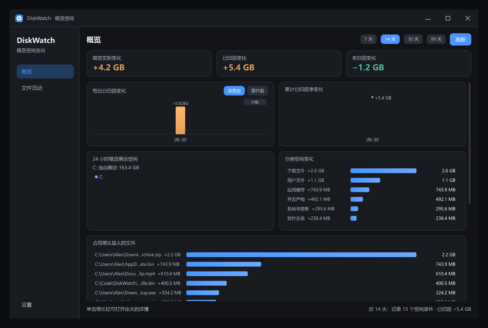
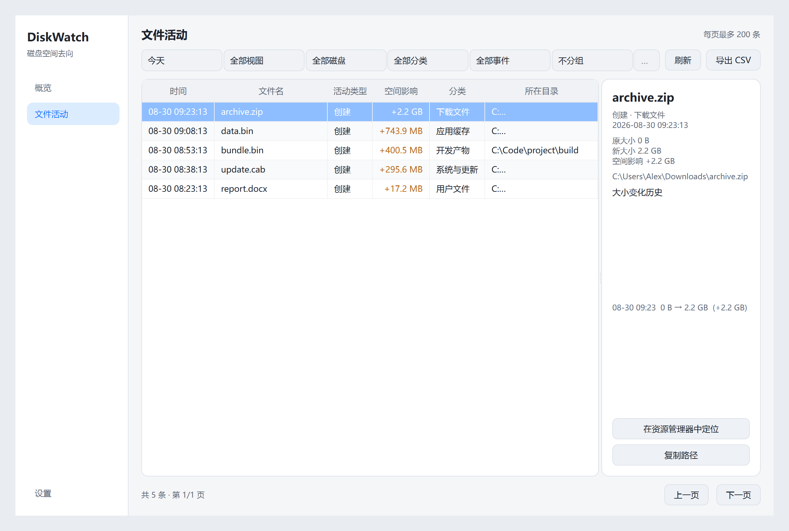
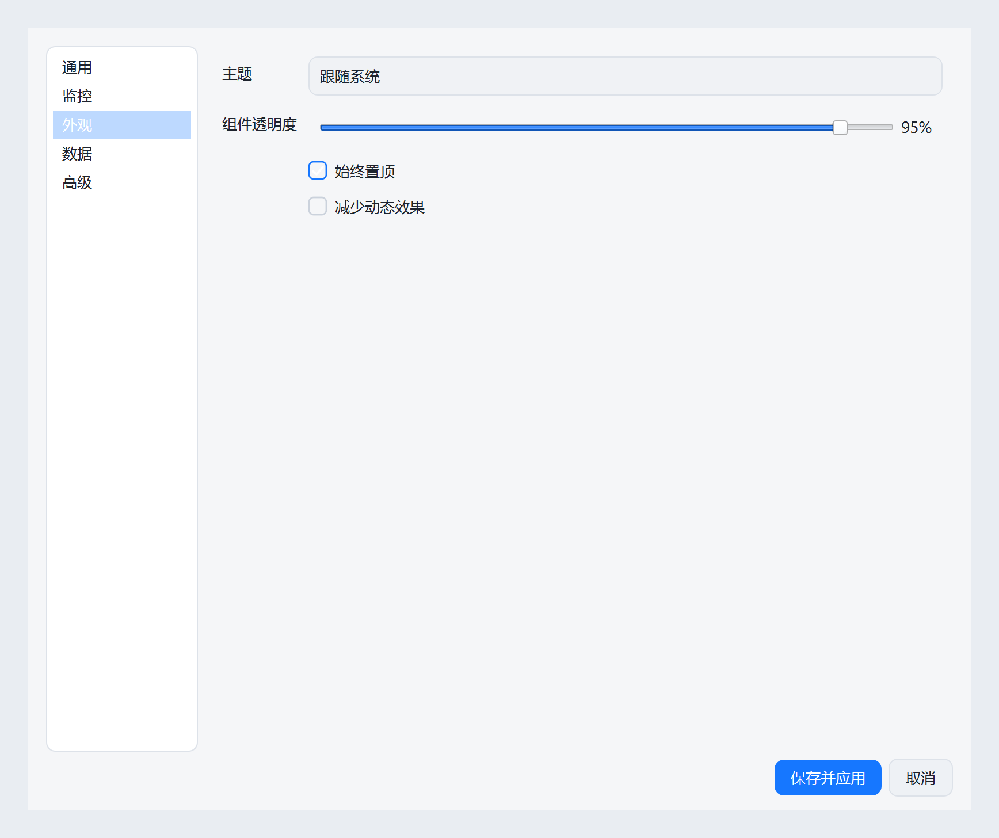
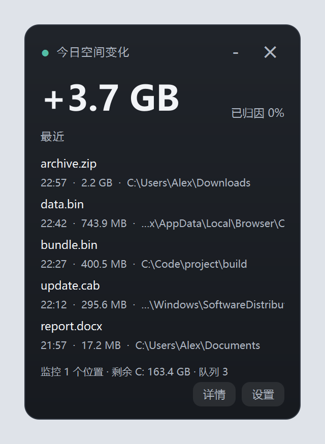

<div align="center">

# 🧭 DiskWatch

**Your C: drive is red again? Find out who ate your space — in 3 seconds.**

Records every new file · Local attribution ledger · Never reads file contents · Zero network

**English** · [中文](README.zh-CN.md)


</div>

---

## 😱 Sound familiar?

- 📉 **C: is full again** — you delete stuff, and it's still full
- 🕵️ **You can't see who's eating it** — caches? updates? that zip you forgot about?
- 🗑️ **You're afraid to delete** — so you just let it grow
- 📦 **You can only see "now"** — Task Manager shows processes, not *which files landed today*

## ✨ DiskWatch turns "where did my space go?" into a reconcilable statement

| The question | DiskWatch's answer |
|---|---|
| How much did I actually lose? | 📊 Free-space sampling every 5 minutes → **actual change** |
| Who ate it? | 🧾 A full ledger of every created / grown / deleted / moved file → **attributed change** |
| What's left? | 🔍 **Unattributed change** = actual − attributed (OS overhead you can't catch) |

```text
C: free space down   8.4 GB
Attributed           7.9 GB   ← drill down to the exact files
Unattributed         0.5 GB   ← the OS's own doing, nothing to worry about
```

## 🚀 Get started in three steps

1. Grab `DiskWatch-2.0.7-win64.zip` from [Releases](https://github.com/niujiaxu/DiskWatch/releases/latest)
2. Unzip anywhere and double-click **`start.bat`** (it bootstraps a venv on first run)
3. Use the **floating card** → open *Details* for the ledger, *Dashboard* for trends

> 💡 No installer, no registry writes, no network. Everything stays in `%APPDATA%\DiskWatch`.

## 📸 Screenshots

<p align="center">
  
</p>
<p align="center"><sub>Dark theme: overview and space attribution (click a bar to jump to that day)</sub></p>

<p align="center">
  
</p>
<p align="center"><sub>Light theme: file activity (200 per page, search / filters / grouping / CSV export)</sub></p>

<p align="center">
  
</p>
<p align="center"><sub>Settings: scope, filters, appearance, data, advanced diagnostics</sub></p>

<p align="center">
  
</p>
<p align="center"><sub>Floating card: today's net change, attribution rate, recent files (draggable)</sub></p>

## 🔥 Highlights

- 🗂 **Capture everything, classify automatically** — user files / downloads / system & updates / software installs / app caches / temp files / dev artifacts / VM & containers / unclassified
- 🚫 **Noise excluded — and auto-folded** — VM disk images (`.vhdx` …), paging files, Temp/cache dirs, `node_modules` and dot-directories (`.git`/`.venv`) are **never recorded**; anything that still churns (the same file changing repeatedly within 10 minutes) is folded into one **"High-churn ×N"** row — net bytes preserved, the list stays readable. Want them too? Just delete the matching line in *Settings → Advanced*
- 🛡 **Safe boundaries** — its own database, logs, device paths and non-regular files are always excluded; it never monitors itself
- ⚡ **Fast startup recovery** — NTFS uses the USN Change Journal; the fallback directory scan runs on **6 parallel workers**: 290k directories in **30s** (down from 187s)
- 🧾 **Space ledger** — old size → new size → delta bytes → category, drive and timestamp, all preserved
- ✍️ **Write coalescing** — a file being written is recorded once, ~6s after it settles
- 📄 **Paged activity table** — 200 rows per page with search, filters, grouping, sorting and CSV export; hundreds of thousands of events stay responsive
- 🧹 **Tiered retention** — raw events 30 days → hourly rollups 1 year → daily rollups kept long-term
- 🎨 **English / 中文 with dark / light / system themes**, hot-swapped at runtime
- 🖥 **Single instance, autostart, relocatable database**

## 🧩 Project map (what every file does)

<details>
<summary><b>📁 Repository root</b></summary>

| File | Purpose |
|---|---|
| `start.bat` | One-click launcher: creates the venv and installs deps on first run, then starts via pythonw (no console) |
| `run.pyw` | Source entry point (double-click friendly, no console window) |
| `run_portable.py` | PyInstaller entry point (includes a packaged import self-test) |
| `DiskWatch.spec` | PyInstaller build spec (onedir, icon, no console) |
| `requirements.txt` | Runtime deps: PySide6 6.11.1, watchdog 6.0.0 |
| `requirements-dev.txt` | Dev deps: pytest / ruff / mypy |
| `pyproject.toml` | pytest (test paths, temp-dir retention), ruff and mypy configuration |
| `conftest.py` | Shared test setup: offscreen QApplication, temp-dir cleanup fixture |
| `CHANGELOG.md` | Release history (currently 2.0.7) |
| `README.md` / `README.zh-CN.md` | English / Chinese docs (the file you're reading) |
| `LICENSE` | MIT license |
| `.gitignore` | Ignores venv, caches, build output, local notes |
| `.gitattributes` | Line-ending/text attributes so scripts survive checkouts |

</details>

<details>
<summary><b>📁 diskwatch/</b> (the app)</summary>

| File | Purpose |
|---|---|
| `__init__.py` | App name and version (`VERSION`) |
| `app.py` | Wiring: single instance, tray, floating surfaces, main window; startup recovery, periodic purge, shutdown |
| `config.py` | JSON config with defaults, filter version, database/config path migration |
| `storage.py` | SQLite persistence: space ledger, hourly/daily rollups, disk samples, tiered purge; split read/write connections (WAL) |
| `watcher.py` | Live monitoring: watchdog events → queue → batched writes; coalescing, size back-fill, disk sampling |
| `scan.py` | Startup scan: parallel directory walk, back-fills files created inside the lookback window (6× faster in 2.0.7) |
| `usn.py` | NTFS USN Change Journal recovery: metadata-only incremental catch-up |
| `classification.py` | File classification rules and capture safety boundaries (`CapturePolicy` / `FileClassifier`) |
| `filters.py` | Path / extension / size filtering and safe `stat` helpers |
| `i18n.py` | English/Chinese translation table and `tr()` |
| `errorlog.py` | Unified error log: rotating file, in-memory ring buffer, tray "recent errors" |
| `autostart.py` | Windows Run-key autostart toggle and status |

</details>

<details>
<summary><b>📁 diskwatch/ui/</b> (the interface)</summary>

| File | Purpose |
|---|---|
| `style.py` | Theme tokens (dark/light), global QSS, custom checkbox painting, Windows titlebar/rounded corners |
| `main_window.py` | Unified window: custom titlebar, sidebar navigation, page stack; frameless edge resizing (native hit-test + cursor + fallbacks) |
| `dashboard.py` | Overview page: three attribution cards + four hand-drawn charts, 7/14/30/90-day ranges, background queries with dirty-check refresh |
| `activity.py` | File activity page: paged ledger table, filters/search/grouping/sorting, detail card, CSV export |
| `charts.py` | Chart widgets: bar / cumulative area / multi-line / horizontal bars — pure QPainter, no third-party chart library |
| `widget.py` | Desktop floating card: today's net change and recent files, draggable |
| `ball.py` | Mini capsule: collapsed mode showing today's net change and attribution rate |
| `picker.py` | `DayPicker`: custom dropdown that dodges Qt's misplaced-popup bug (QComboBox is banned project-wide) |
| `settings.py` | Settings dialog (embeddable): general / scope / appearance / data / advanced plus runtime diagnostics |

</details>

<details>
<summary><b>📁 tests/</b> (138 tests — one read and you know the contracts)</summary>

| File | Covers |
|---|---|
| `activity_test.py` | Activity page: paging, filters, group collapsing, never blocks the UI thread |
| `config_test.py` | Config round-trips, corrupted-value defence, path migration |
| `dashboard_test.py` | Dashboard aggregates, chart behaviour, scaling with the window |
| `disk_space_test.py` | Disk sampling and retention purge |
| `filters_test.py` | Filter rules (extensions / paths / sizes / system dirs) |
| `i18n_test.py` | Translation completeness (scans all sources) and language hot-swap |
| `move_regression_test.py` | Rename/move regression (same-drive moves are not "new files") |
| `scan_test.py` | Scan: back-fill, mtime pruning, instant cancel, finish even when a flush fails |
| `smoke_test.py` | End-to-end smoke: seed → record → read back |
| `space_ledger_test.py` | Ledger: create / grow / shrink / delete / cross-drive moves, rollups and purge |
| `storage_test.py` | Storage: inserts, dedupe, resurrect-on-recreate, migration, write-lock timeout |
| `theme_test.py` | Theme switching, checkbox painting, resize hit-tests and filters |
| `ui_convention_test.py` | UI convention: AST scan bans QComboBox |
| `ui_state_test.py` | Card / mini-ball / hidden states, window shrinkability, scan finish |
| `usn_test.py` | USN parsing, action coalescing, cursor handling, cancel semantics |
| `watcher_change_test.py` | Live monitoring pipeline (create / modify / delete / move) |
| `perf_probe.py` | Performance probe: synthetic 100k-event benchmark (see `docs/performance.md`) |
| `render_preview.py` | Off-screen rendering of the screenshots above (synthetic data only) |

</details>

<details>
<summary><b>📁 scripts/ and 📁 docs/</b></summary>

| File | Purpose |
|---|---|
| `scripts/build_portable.ps1` | Builds the portable PyInstaller bundle (onedir) plus a packaged import self-test |
| `scripts/make_release.ps1` | Builds the source zip (excludes `.venv` and caches) |
| `docs/performance.md` | Performance and disk-impact notes (100k-event benchmark, limits) |
| `docs/main-dark-preview.png` | Dark-theme main window screenshot |
| `docs/main-light-preview.png` | Light-theme main window screenshot |
| `docs/settings-preview.png` | Settings page screenshot |
| `docs/widget-preview.png` | Floating card screenshot |

</details>

## 🧪 Develop and verify

```powershell
# One-click start (bootstraps .venv)
start.bat

# Quality gates
.\.venv\Scripts\python.exe -m pytest tests -q
.\.venv\Scripts\python.exe -m ruff check .
.\.venv\Scripts\python.exe -m mypy diskwatch
```

## 🔒 Privacy

- Never reads or uploads file contents
- Never sends names, paths or statistics anywhere
- Everything lives locally: `%APPDATA%\DiskWatch\diskwatch.db`, `config.json`

## ❓ FAQ

**Does scanning harm my drive?** Live monitoring is event-driven and never walks the whole disk; only startup recovery reads metadata (USN first) and can be cancelled anytime. See [Performance and disk impact](docs/performance.md).

**Why are some files "not counted"?** VM disk images (`.vhdx`), paging files, Temp/cache dirs, `node_modules` and dot-directories churn at GB scale; recording them would drown out meaningful changes. They are excluded by default, and **exclusions always apply**. Want them too? Delete the matching line in *Settings → Advanced*.

## 📄 License

MIT.

---

<div align="center">

**If this saved your C: drive, drop a ⭐ — it helps others find it too 🙌**

</div>
