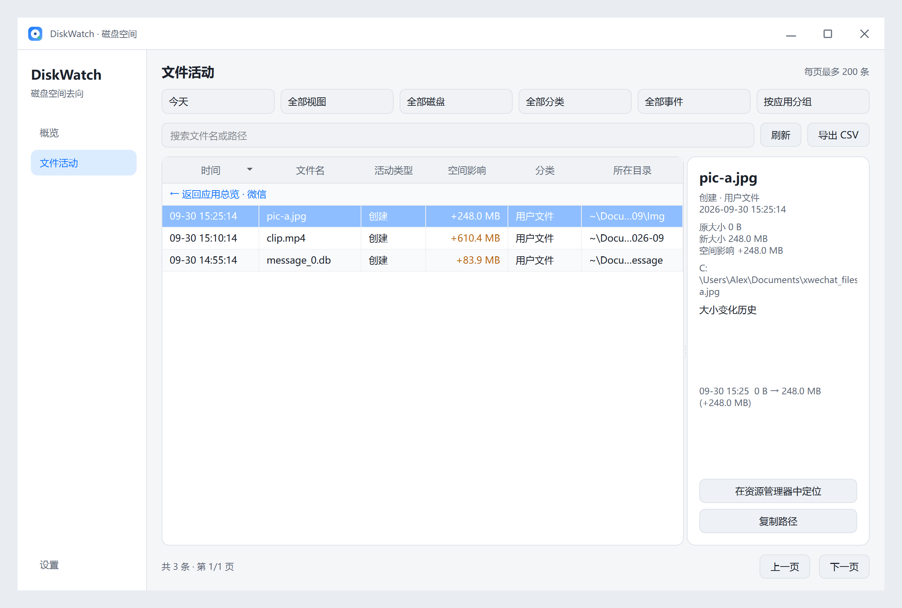
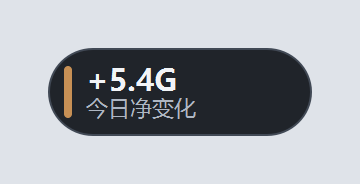
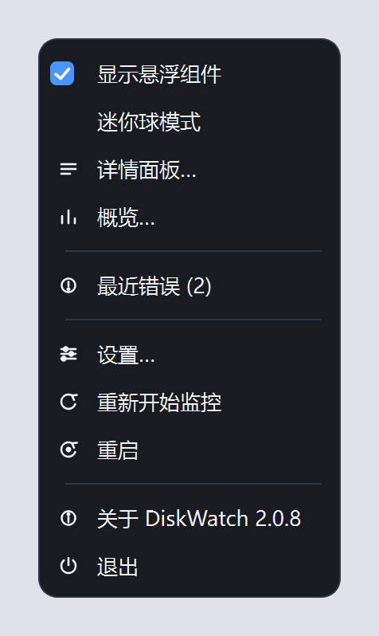

<div align="center">

# 🧭 DiskWatch

**C 盘又红了？3 秒告诉你，空间被谁吃掉了。**

全量记录每个新增文件 · 本地归因对账 · 不读文件内容 · 零联网上传

[English](README.md) · **中文**


</div>

---

## 😱 先看痛点，是不是条条都中

- 📉 **C 盘爆红**，删了半天空间还是不够
- 🕵️ **不知道谁在偷吃**：缓存？系统更新？还是那个下载完就忘的压缩包？
- 🗑️ **不敢乱删**，只能眼睁睁看着它满
- 📦 **只看得到"现在"**：任务管理器告诉你哪个进程在占，但不告诉你**今天新落了哪些文件**

## ✨ DiskWatch：把"空间去向"变成一张对账单

| 你关心的 | DiskWatch 的回答 |
|---|---|
| 到底少了多少？ | 📊 每 5 分钟采样各盘剩余空间 → **实际变化** |
| 被谁吃掉的？ | 🧾 全量记录新增 / 增长 / 删除 / 移动的文件 → **已归因变化** |
| 剩下的是啥？ | 🔍 **未归因变化** = 实际 − 已归因（系统开销、没抓到的，一眼看穿） |

```text
C: 可用空间减少    8.4 GB
已归因             7.9 GB   ← 谁吃的，点开就是明细
未归因             0.5 GB   ← 系统自己花的，不用慌
```

## 🚀 三步上手（真的只有三步）

1. 去 [Releases](https://github.com/niujiaxu/DiskWatch/releases/latest) 下载 `DiskWatch-2.0.8-win64-portable.zip`
2. 解压到任意目录，双击 **`start.bat`**（首次运行会自动建虚拟环境、装依赖）
3. 桌面出现**悬浮卡片** → 点「详情」看明细、「看板」看趋势

> 💡 没有安装包、不写注册表、不联网、数据全在本机 `%APPDATA%\DiskWatch`

## 📸 界面长这样

<p align="center">
  
</p>
<p align="center"><sub>深色主题：概览与空间归因（点柱体可跳当天明细）</sub></p>

<p align="center">
  
</p>
<p align="center"><sub>浅色主题：文件活动 · 按应用分组总览（下载 / 微信 / QQ / 各软件各归一组，跨页一致）</sub></p>

<p align="center">
  
</p>
<p align="center"><sub>点一行下钻到该应用明细：目录列显示"应用老家"并智能缩写，悬停看完整路径与归属应用</sub></p>

<p align="center">
  
</p>
<p align="center"><sub>设置：监控范围、过滤规则、外观、数据、高级诊断</sub></p>

<p align="center">
  
</p>
<p align="center"><sub>悬浮卡片：今日净变化、归因率、最近记录（可拖动）</sub></p>

<p align="center">
  
</p>
<p align="center"><sub>迷你球：收起态小胶囊，点一下在球的位置展开卡片</sub></p>

<p align="center">
  
</p>
<p align="center"><sub>右键菜单：圆角卡片 + 线性图标，跟随深浅主题（托盘 / 卡片 / 迷你球统一）</sub></p>

## 🔥 亮点（硬核，但说人话）

- 🗂 **全量采集 + 自动分类**：用户文件 / 下载 / 系统与更新 / 软件安装 / 应用缓存 / 临时文件 / 开发产物 / 虚拟机容器 / 未分类
- 🚫 **噪音默认排除 + 动态折叠**：VM 磁盘镜像（`.vhdx` 等）、系统分页文件、Temp / 缓存目录、`node_modules`、点目录（`.git`/`.venv`）**不计入账本**；漏网的"高频抖动"（同一文件 10 分钟内反复变化）会自动折叠成一条 **「高频变化 ×N」**——净字节一条不丢，列表不再刷屏。想看得更全，在「设置 → 高级」删掉对应排除项即可
- 📱 **按应用分组（默认视图）**：活动页自动识别每个应用的地盘（AppData / Program Files / "<X> Files" / 点目录 / Temp…），QQ 的聊天数据、微信的图片、各软件的安装变化各归一组；超大组自动按账号拆分，零碎小变化收进「其它位置」，点一行即可下钻看该应用的全部明细（跨页一致）
- 🛡 **安全边界**：永远排除自己的数据库、日志、设备路径与非常规文件 —— 绝不"自己监控自己"
- ⚡ **启动恢复够快**：NTFS 优先走 USN 变更日志；退回目录补扫时**6 线程并行**，29 万目录实测 **30 秒**（优化前 187 秒）
- 🧾 **空间账本**：旧大小 → 新大小 → 字节差 → 分类 / 磁盘 / 时间，全留着、可回溯
- ✍️ **写入合并**：同一文件连续写入只在"停笔"约 6 秒后记一次，事件洪峰也不刷屏
- 📄 **分页活动表**：每页 200 条，5 列可排序、搜索 / 筛选 / 分组 / CSV 导出；目录列显示"应用老家"并智能缩写（`~\Documents\Tencent Files`），悬停看完整路径 + 归属应用
- 🖱 **现代右键菜单**：托盘 / 悬浮卡片 / 迷你球统一圆角卡片样式 + 16px 线性图标，跟随深浅主题即时重绘
- 🧹 **分层保留**：原始事件 30 天 → 小时汇总 1 年 → 每日汇总长期保留（自动清理，不涨库）
- 🎨 **中英双语 + 深色 / 浅色 / 跟随系统**，运行时即时切换
- 🖥 **单实例防重复启动 + 开机自启 + 数据库位置可迁移**

## 🧩 项目文件地图（每个文件都是干嘛的）

<details>
<summary><b>📁 根目录</b>（点开看每个文件）</summary>

| 文件 | 作用 |
|---|---|
| `start.bat` | 一键启动：缺 venv 就自动创建 + 装依赖，然后用 pythonw 无控制台启动 |
| `run.pyw` | 源码运行入口（双击即跑，无黑窗） |
| `run_portable.py` | PyInstaller 打包入口（带打包后自检模式） |
| `DiskWatch.spec` | PyInstaller 打包配置（onedir、图标、隐藏控制台） |
| `requirements.txt` | 运行时依赖：PySide6 6.11.1、watchdog 6.0.0 |
| `requirements-dev.txt` | 开发依赖：pytest / ruff / mypy |
| `pyproject.toml` | pytest（测试范围、临时目录保留策略）/ ruff / mypy 配置 |
| `conftest.py` | 测试公共配置：offscreen QApplication、测试临时目录收尾清理 |
| `CHANGELOG.md` | 版本变更记录（当前 2.0.7） |
| `README.md` / `README.zh-CN.md` | 英文 / 中文说明（就是你正在看的这份） |
| `LICENSE` | MIT 许可证 |
| `.gitignore` | 忽略虚拟环境、缓存、打包产物、本地配置 |
| `.gitattributes` | Git 行尾/文本属性，保证脚本不被改坏 |

</details>

<details>
<summary><b>📁 diskwatch/</b>（应用核心）</summary>

| 文件 | 作用 |
|---|---|
| `__init__.py` | 应用名 + 版本号（VERSION） |
| `app.py` | 总装配：单实例、托盘、悬浮组件、主窗口接线；启动补扫/定时清理/退出流程 |
| `apps.py` | 按应用分组：从路径推断归属应用（归属根）、产品级合并（QQ/微信/…）、均衡聚类（超大组拆分、长尾收进「其它位置」） |
| `config.py` | 配置读写（JSON）、默认值、过滤器版本、数据库/配置路径迁移 |
| `storage.py` | SQLite 持久化：空间账本、小时/日汇总、磁盘采样、分层清理；读写分连接（WAL，不堵 UI） |
| `watcher.py` | 实时监控：watchdog 事件 → 队列 → 后台批量写库；写入合并、体积回填、磁盘采样 |
| `scan.py` | 启动补扫：并行遍历目录、按创建时间回看窗口补齐缺失记录（2.0.7 提速约 6 倍） |
| `usn.py` | NTFS USN 变更日志恢复：只读元数据，增量补齐"程序没在跑"期间的变化 |
| `classification.py` | 文件分类规则 + 采集安全边界（CapturePolicy / FileClassifier） |
| `filters.py` | 路径 / 扩展名 / 体积过滤与安全 stat（关注模式复用） |
| `i18n.py` | 中英翻译表与 `tr()` 文案 |
| `errorlog.py` | 统一错误日志：轮转文件 + 内存环形缓冲 + 托盘"最近错误" |
| `autostart.py` | 开机自启（注册表 Run 项）开关与状态查询 |

</details>

<details>
<summary><b>📁 diskwatch/ui/</b>（界面层）</summary>

| 文件 | 作用 |
|---|---|
| `__init__.py` | 界面层包声明 |
| `style.py` | 主题令牌（深/浅）、全局 QSS、自绘控件样式（复选框勾选态）、Windows 标题栏与圆角 |
| `main_window.py` | 统一主窗口：自绘标题栏、侧栏导航、三页栈；无边框边缘缩放（原生命中 + 缩放光标 + 兜底） |
| `dashboard.py` | 概览页：归因三卡 + 4 张自绘图表，7/14/30/90 天范围，后台查询 + 脏检查自动刷新 |
| `activity.py` | 文件活动页：账本分页表格、筛选/搜索/分组/排序、右侧详情卡、CSV 导出 |
| `charts.py` | 自绘图表组件：柱状 / 累计面积 / 多折线 / 横向条形（纯 QPainter，零第三方图表依赖） |
| `widget.py` | 桌面悬浮卡片：今日净变化、最近记录、可拖动 |
| `ball.py` | 迷你胶囊：收起态显示今日净变化与归因率 |
| `picker.py` | DayPicker：自绘下拉（规避 Qt 置顶窗弹层错位 bug，全项目禁用 QComboBox） |
| `settings.py` | 设置对话框（可嵌入主窗口）：通用/监控/外观/数据/高级五页 + 运行诊断 |

</details>

<details>
<summary><b>📁 tests/</b>（138 个测试，跑一遍就懂每个模块的契约）</summary>

| 文件 | 覆盖内容 |
|---|---|
| `activity_test.py` | 活动页：分页、筛选、分组折叠、不阻塞 UI |
| `config_test.py` | 配置读写、损坏值防御、路径迁移 |
| `apps_test.py` | 按应用分组：归属根推断、产品合并、拆分与长尾规则 |
| `dashboard_test.py` | 看板：聚合查询、图表行为、随窗口缩放 |
| `disk_space_test.py` | 磁盘采样与保留清理 |
| `filters_test.py` | 过滤规则（扩展名 / 路径 / 体积 / 系统目录） |
| `i18n_test.py` | 翻译完整性（扫描全部源码）+ 语言热切换 |
| `move_regression_test.py` | 移动 / 改名回归（同盘移动不算新增） |
| `scan_test.py` | 补扫：补回、剪枝、取消即时、写库失败也能收尾 |
| `smoke_test.py` | 完整冒烟：造库 → 写事件 → 读回 |
| `space_ledger_test.py` | 空间账本：增 / 减 / 移动 / 跨盘、汇总与清理 |
| `storage_test.py` | 存储层：入库、去重、删除复活、迁移、写锁超时 |
| `theme_test.py` | 主题切换、复选框勾选样式、边缘缩放命中码与过滤器 |
| `ui_convention_test.py` | UI 约定：AST 扫描禁止 QComboBox（必须用 DayPicker） |
| `ui_state_test.py` | 卡片 / 迷你球 / 隐藏状态、窗口可缩、补扫收尾 |
| `usn_test.py` | USN 解析 / 动作合并 / 游标恢复 / 取消不推进游标 |
| `watcher_change_test.py` | 实时监控链路（创建 / 修改 / 删除 / 移动） |
| `perf_probe.py` | 性能探针：合成 10 万事件测吞吐（见 `docs/performance.md`） |
| `render_preview.py` | 离屏渲染本文档里的截图（合成数据，不碰真实库） |

</details>

<details>
<summary><b>📁 scripts/ 与 📁 docs/</b>（打包与文档）</summary>

| 文件 | 作用 |
|---|---|
| `scripts/build_portable.ps1` | PyInstaller 打包便携版（onedir）+ 打包后导入自检 |
| `scripts/make_release.ps1` | 生成源码 zip（剔除 .venv 与缓存） |
| `docs/performance.md` | 性能与磁盘影响说明（含 10 万事件基准、适用边界） |
| `docs/main-dark-preview.png` | 深色主题主窗口截图（概览） |
| `docs/main-light-preview.png` | 浅色主题主窗口截图（按应用分组总览） |
| `docs/activity-drill-preview.png` | 应用下钻明细截图（目录列缩写 + tooltip） |
| `docs/settings-preview.png` | 设置页截图 |
| `docs/widget-preview.png` | 悬浮卡片截图 |
| `docs/ball-preview.png` | 迷你球截图 |
| `docs/menu-preview.png` | 右键菜单截图（圆角卡片 + 线性图标） |

</details>

## 🧪 自己跑一遍（开发者）

```powershell
# 一键启动（自动准备 .venv）
start.bat

# 质量门：测试 + lint + 类型检查
.\.venv\Scripts\python.exe -m pytest tests -q
.\.venv\Scripts\python.exe -m ruff check .
.\.venv\Scripts\python.exe -m mypy diskwatch
```

## 🔒 隐私（一句话：什么都没上传）

- 不读取、不上传任何文件内容
- 不发送文件名、路径、统计到任何服务器
- 数据只在本机：`%APPDATA%\DiskWatch\diskwatch.db`、`config.json`

## ❓ 常见疑问

**扫盘会伤硬盘吗？** 正常监控由文件系统事件驱动，不持续遍历整盘；只有启动恢复会读元数据（USN 日志优先），且可随时取消。详见 [性能与磁盘影响](docs/performance.md)。

**为什么有些文件"不算"？** VM 磁盘镜像（.vhdx）、系统分页文件、Temp/缓存目录、`node_modules`、点目录这类地方每分钟都在 GB 级读写，计入账本只会把真正有意义的变化冲掉——所以默认排除，且**排除项在什么时候都生效**。想看得更全，在「设置 → 高级」删掉对应行即可。

**重装/换电脑会丢数据吗？** 不会自动同步（也不建议）——数据是本地账本，可在设置里迁移数据库位置。

---

<div align="center">

**喜欢的话点个 ⭐ Star，让更多人告别"C 盘又红了" 🙌**

MIT License · 不读文件内容 · 零联网

</div>
